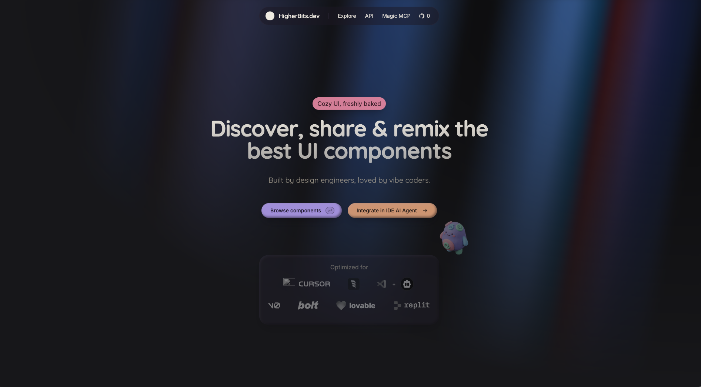

# 🚀 HigherBits.dev

**Production UI Component Registry & Marketplace for Developers, Designers, and Agencies**

 

---

## 🌟 What is HigherBits.dev?

**[HigherBits.dev](https://higherbits.dev)** is an open-source community registry and marketplace for **production-ready React UI components**, templates, themes, ASCII art, gradients, and shaders.

Inspired by the component philosophy of [shadcn/ui](https://ui.shadcn.com/) and built for modern design engineers and vibe coders, HigherBits eliminates generic "AI slop" by providing distinctive, polished, and accessible UI blocks powered by **React 19**, **Next.js 15**, **Tailwind CSS**, and **Radix UI**.

Beyond standard copy-paste, HigherBits is engineered with a **Multi-Format AI Prompt Engine** that transforms React components on-the-fly into self-contained widgets for **GoHighLevel**, as well as optimized system prompts for **Claude**, **Cursor**, **Codex**, **Antigravity**, **v0**, **Bolt.new**, and **Lovable**.

---

## ✨ Key Features

- ⚡ **Production-Ready Component Registry**: Copy-paste React components with zero runtime dependencies on HigherBits. Accessible, responsive, and styled with Tailwind CSS variables.
- 🔄 **Multi-Platform AI Prompt Engine**: One-click prompt copying tailored for your AI workflow:
  - **GoHighLevel (GHL)**: Generates self-contained HTML/CSS/JS with embedded Tailwind runtime and scoped resets, engineered for GHL custom code blocks.
  - **Claude, Cursor, Codex & Antigravity**: Structured prompts containing component logic, dependencies, and styles ready for your AI agent.
  - **v0 by Vercel, Bolt.new, Lovable, Replit, Magic Patterns & sitebrew.ai**: Specially tuned prompts for each visual builder.
- 🎨 **Creator Studio**: A comprehensive authoring suite where creators can build, preview, manage, and publish:
  - **Components**: Live sandbox editor with support for multiple demos.
  - **Themes**: Design token palettes and theme definitions.
  - **Templates**: Full-page marketing and funnel layouts.
  - **Libraries**: Curated collections of related components.
  - **ASCII Art, Gradients & WebGL/Three.js Shaders**: Creative visual building blocks.
- 💻 **Interactive Sandpack Preview**: Real-time interactive sandboxes for testing components, switching dark/light themes, and inspecting source code before copying.
- 📦 **CLI Integration**: Install components directly into your project:
  \`\`\`bash
  npx higherbits add <component-slug>
  # or via shadcn CLI:
  npx shadcn@latest add "https://higherbits.dev/r/<author>/<component-slug>"
  \`\`\`
- 💰 **Monetization & Bundles**: Creators can monetize their craft with bundle sales and subscriptions powered by Stripe and Lemon Squeezy.

---

## ⚡ Quick Install

Found a component you love on [HigherBits.dev](https://higherbits.dev)? Install it directly into your project with a single command:

\`\`\`bash
# Using HigherBits CLI
npx higherbits add <component-slug>

# Or using shadcn CLI
npx shadcn@latest add "https://higherbits.dev/r/<author>/<component-slug>"
\`\`\`

This will automatically:
- Download the component and its sub-components into your `/components/ui` directory.
- Configure any required Tailwind extensions in your config.
- Install necessary npm packages (e.g. Radix primitives, Lucide icons, Framer Motion).

---

## 🏗️ Architecture & Technology Stack

HigherBits is architected as a high-performance modern monorepo:

| Layer | Technologies |
|---|---|
| **Framework** | [Next.js 15](https://nextjs.org/) (App Router, Server Actions, Turbopack) & [React 19](https://react.dev/) |
| **Language** | [TypeScript](https://www.typescriptlang.org/) (Strict type safety) |
| **Styling** | [Tailwind CSS](https://tailwindcss.com/) with CSS variables, [Radix UI](https://www.radix-ui.com/) primitives |
| **Icons & Motion** | [Lucide React](https://lucide.dev/), [Motion / Framer Motion](https://motion.dev/), [NumberFlow](https://number-flow.barvian.me/) |
| **Sandbox & Code** | [@codesandbox/sandpack-react](https://sandpack.codesandbox.io/), [Monaco Editor](https://microsoft.github.io/monaco-editor/) |
| **Database & ORM** | [Supabase](https://supabase.com/) (PostgreSQL, Row Level Security, Realtime), [Prisma ORM](https://www.prisma.io/) |
| **Authentication** | [Clerk](https://clerk.com/) (User management, session handling, OAuth) |
| **Asset Storage** | [Cloudflare R2](https://www.cloudflare.com/developer-platform/r2/) & AWS S3 presigned storage for code, previews, and videos |
| **AI Synthesis** | [OpenRouter](https://openrouter.ai/) & LLM endpoints for on-demand GHL template generation |
| **Analytics** | [Amplitude](https://amplitude.com/) analytics and session recording |
| **Deployment** | Self-hosted Linux VPS, [PM2](https://pm2.keymetrics.io/), Nginx reverse proxy with automated sync pipeline |

---

## 🚀 Getting Started (Local Development)

### Prerequisites

- **Node.js**: `>= 18.0.0`
- **pnpm**: `>= 8.0.0` (`npm install -g pnpm`)
- Accounts for **Supabase**, **Clerk**, and **Cloudflare R2** (for full cloud backend features)

### 1. Clone the Repository

\`\`\`bash
git clone https://github.com/CLDGayo/higherbits.git
cd higherbits
\`\`\`

### 2. Install Dependencies

\`\`\`bash
pnpm install
\`\`\`

### 3. Configure Environment Variables

Create `.env.local` inside `apps/web/`:

\`\`\`bash
cp apps/web/.env.example apps/web/.env.local
\`\`\`

Fill in your environment credentials:

\`\`\`env
# Supabase
NEXT_PUBLIC_SUPABASE_URL=https://your-project.supabase.co
NEXT_PUBLIC_SUPABASE_KEY=your-supabase-anon-key
SUPABASE_SERVICE_ROLE_KEY=your-supabase-service-role-key

# Clerk Authentication
NEXT_PUBLIC_CLERK_PUBLISHABLE_KEY=pk_test_...
CLERK_SECRET_KEY=sk_test_...
CLERK_WEBHOOK_SECRET=whsec_...

# Cloudflare R2 / S3 Storage
NEXT_PUBLIC_CDN_URL=https://your-cdn-domain.com
R2_ACCESS_KEY_ID=your-r2-access-key
R2_SECRET_ACCESS_KEY=your-r2-secret-key
NEXT_PUBLIC_R2_ENDPOINT=https://your-account-id.r2.cloudflarestorage.com

# OpenRouter / OpenAI (for GHL prompt generation)
OPENAI_API_KEY=sk-or-v1-...
OPENAI_BASE_URL=https://openrouter.ai/api/v1
OPENAI_MODEL=minimax/minimax-m3:free

# Application URL
NEXT_PUBLIC_APP_URL=http://localhost:3000
\`\`\`

### 4. Run Development Server

\`\`\`bash
pnpm dev
\`\`\`

Open [http://localhost:3000](http://localhost:3000) in your browser.

---

## 🧪 Testing & Quality Verification

\`\`\`bash
# Run unit tests across packages
pnpm --filter web test

# Run TypeScript typechecks
pnpm --filter web typecheck

# Run linter
pnpm lint

# Build production assets
pnpm build
\`\`\`

---

## 🛠️ Creator Guidelines: Publishing on HigherBits

Creators can share their UI components, themes, templates, and shaders directly via the [HigherBits Publish Portal](https://higherbits.dev/publish) or within the **Creator Studio** (`/studio`).

### Lifecycle of a Component:
1. **Initial Review** (`on_review`): Accessible via direct URL while awaiting review.
2. **Published** (`posted`): Approved and displayed on your public creator profile.
3. **Featured** (`featured`): Showcased on the homepage and highlighted in category carousels.

### Quality Standards:
- **Separation of Concerns**: Keep component logic (`code.tsx`) clean and separate from demo/presentation logic (`demos/default/code.demo.tsx`).
- **Theming & Color Contrast**: Rely on CSS variables (e.g. `hsl(var(--background))`, `hsl(var(--foreground))`) and ensure full light/dark mode support.
- **Accessibility**: Support keyboard navigation, ARIA roles, and high-contrast color ratios.
- **Type Safety**: Write pure TypeScript with well-defined prop interfaces and meaningful default values.

---

## 👥 Community & Connect

- 🌐 **Platform**: [higherbits.dev](https://higherbits.dev)
- 📖 **Our Story**: [higherbits.dev/our-story](https://higherbits.dev/our-story)
- 💬 **Discord**: [Join our Discord Community](https://discord.gg/Qx4rFunHfm)
- 🐦 **X (Twitter)**: [@CLDGayo](https://x.com/CLDGayo)
- 🐙 **GitHub**: [github.com/CLDGayo/higherbits](https://github.com/CLDGayo/higherbits)

---

## 📄 License

HigherBits is licensed under the [MIT License](./LICENSE).

Built with ❤️ by [Clarence Lloyd Gayo](https://x.com/CLDGayo) and the HigherBits community.
