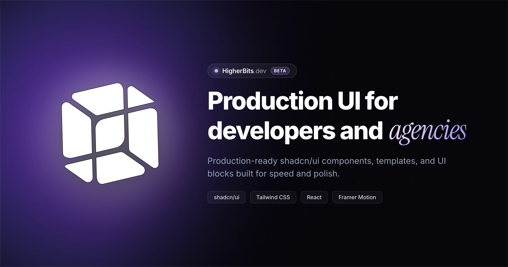

<div align="center">

# 🚀 HigherBits.dev

**Production UI for developers and agencies**

[](https://higherbits.dev)
[](https://github.com/CLDGayo/higherbits)
[](https://discord.gg/vWqmFjPMU4)
[](https://x.com/CLDGayo)
[](./LICENSE)

<br />



</div>

---

## 🌟 What is HigherBits.dev?

**[HigherBits.dev](https://higherbits.dev)** is a marketplace and creator platform for production-ready **shadcn/ui React components, templates, and UI blocks**. Developers and agencies can browse examples, inspect source, and bring components into their projects or AI-assisted workflows.

The site's current promise is **"Production UI for developers and agencies."** The live homepage describes its audience as developers, agencies, and technical virtual assistants.

Built around the copy-and-adapt approach of [shadcn/ui](https://ui.shadcn.com/), HigherBits pairs ready-to-edit React and Tailwind source with prompts for coding agents and builders.

---

## ✨ Key Features

- ⚡ **Component library**: Browse and search a changing catalog of React components, inspect examples and source, and copy what you need.
- 🧱 **Templates and UI blocks**: Explore reusable page layouts alongside individual components.
- 🤖 **Copyable prompts**: The site demonstrates workflows for Claude Code, Codex, Antigravity, and GoHighLevel.
- 🎨 **Creator tools**: Signed-in creators can use `/publish` and `/studio` to work with components, templates, libraries, themes, ASCII art, gradients, and shaders.
- 👤 **Creator discovery**: Browse creator profiles, collections, and curated libraries.
- 📦 **Project handoff**: Use each component page's preview, source, and copy/prompt controls. A shadcn-compatible registry endpoint is present, though direct production CLI installation was not verified in this review.

## Current site

The homepage opens with a left-aligned **"Production UI for developers and agencies"** hero, global search, and links to Components and Templates. In light mode, it uses pale lavender surfaces, a soft purple glow, and rounded purple calls to action; a dark theme is also available. Below the hero are live component rows, a prompt-copy demonstration, the catalogue, creator and agent sections, and FAQs. Catalogue counts change with the live data, so this README does not hard-code one.

---

## Use a component

Open a component on [HigherBits.dev](https://higherbits.dev), inspect its preview and source, then use the page's copy or prompt controls to bring it into your project. The repository includes a shadcn-compatible registry endpoint; check the live component page for the currently available handoff options.

---

## 🏗️ Architecture & Technology Stack

HigherBits is architected as a high-performance modern monorepo:

| Layer | Technologies |
|---|---|
| **Framework** | [Next.js 15](https://nextjs.org/) (App Router, Server Actions, Turbopack) & [React 19](https://react.dev/) |
| **Language** | [TypeScript](https://www.typescriptlang.org/) (Strict type safety) |
| **Styling** | [Tailwind CSS](https://tailwindcss.com/) with CSS variables, [Radix UI](https://www.radix-ui.com/) primitives |
| **Icons & Motion** | [Lucide React](https://lucide.dev/), [Motion / Framer Motion](https://motion.dev/), [NumberFlow](https://number-flow.barvian.me/) |
| **Sandbox & Code** | [@codesandbox/sandpack-react](https://sandpack.codesandbox.io/), [Monaco Editor](https://microsoft.github.io/monaco-editor/) |
| **Database & ORM** | [Supabase](https://supabase.com/) (PostgreSQL, Row Level Security, Realtime), [Prisma ORM](https://www.prisma.io/) |
| **Authentication** | [Clerk](https://clerk.com/) (User management, session handling, OAuth) |

---

## 🚀 Getting Started (Local Development)

### Prerequisites

- **Node.js**: `>= 18.0.0`
- **pnpm**: `>= 8.0.0` (`npm install -g pnpm`)
- **Supabase** and **Clerk** credentials for the connected app features; optional integrations need their own credentials.

### 1. Clone the Repository

```bash
git clone https://github.com/CLDGayo/higherbits.git
cd higherbits
```

### 2. Install Dependencies

```bash
pnpm install
```

### 3. Configure Environment Variables

Create `apps/web/.env.local` with the Supabase and Clerk values required by your setup. Optional integration variables are listed in the repository-root [`.env.example`](./.env.example). This repository does not currently include an `apps/web/.env.example` template.

### 4. Run Development Server

```bash
pnpm dev
```

Open [http://localhost:3000](http://localhost:3000) in your browser.

---

## 🧪 Testing & Quality Verification

```bash
# Run unit tests across packages
pnpm --filter web test

# Run TypeScript typechecks
pnpm --filter web typecheck

# Run linter
pnpm lint

# Build production assets
pnpm build
```

---

## 🛠️ Creator Guidelines: Publishing on HigherBits

Creators can share their UI components, themes, templates, and shaders directly via the [HigherBits Publish Portal](https://higherbits.dev/publish) or within the **Creator Studio** (`/studio`).

### Lifecycle of a Component:
1. **Initial Review** (`on_review`): Accessible via direct URL while awaiting review.
2. **Published** (`posted`): Approved and displayed on your public creator profile.
3. **Featured** (`featured`): Showcased on the homepage and highlighted in category carousels.

### Quality Standards:
- **Separation of Concerns**: Keep component logic (`code.tsx`) clean and separate from demo/presentation logic (`demos/default/code.demo.tsx`).
- **Theming & Color Contrast**: Rely on CSS variables (e.g. `hsl(var(--background))`, `hsl(var(--foreground))`) and ensure full light/dark mode support.
- **Accessibility**: Support keyboard navigation, ARIA roles, and high-contrast color ratios.
- **Type Safety**: Write pure TypeScript with well-defined prop interfaces and meaningful default values.

---

## 👥 Community & Connect

- 🌐 **Platform**: [higherbits.dev](https://higherbits.dev)
- 📖 **Our Story**: [higherbits.dev/our-story](https://higherbits.dev/our-story)
- 💬 **Discord**: [Join our Discord Community](https://discord.gg/vWqmFjPMU4)
- 🐦 **X (Twitter)**: [@CLDGayo](https://x.com/CLDGayo)
- 🐙 **GitHub**: [github.com/CLDGayo/higherbits](https://github.com/CLDGayo/higherbits)

---

## 📄 License

HigherBits is licensed under the [MIT License](./LICENSE).

Built with ❤️ by [Clarence Lloyd Gayo](https://x.com/CLDGayo) and the HigherBits community.
