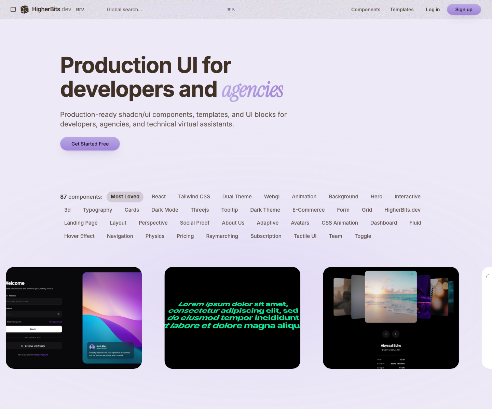
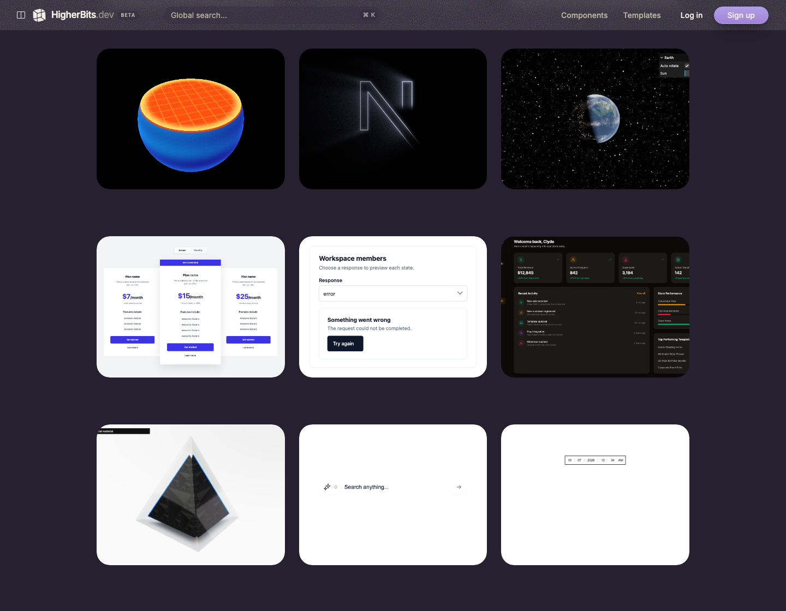
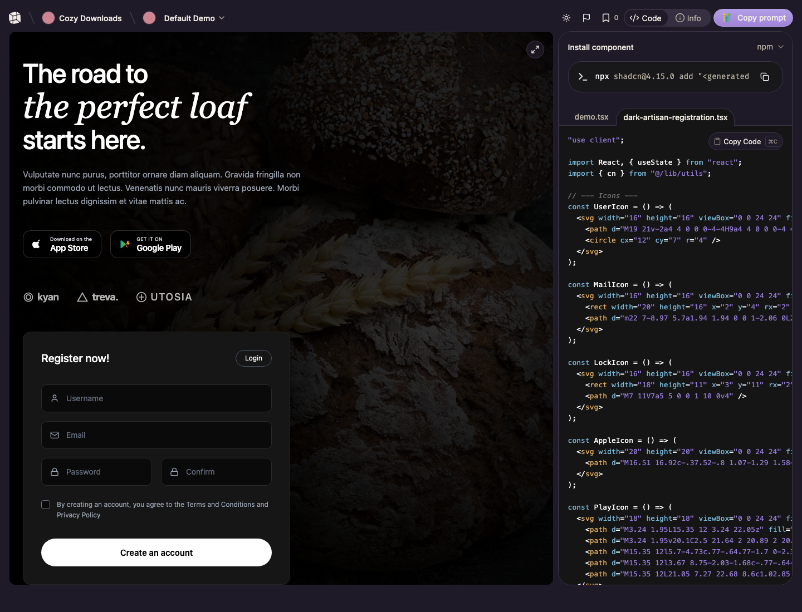

<div align="center">

# [HigherBits.dev](https://higherbits.dev)

**Production UI for developers and agencies.** Browse React components, templates, and UI blocks built for shadcn/ui-based projects — inspect the source, then copy it into your own.

[](https://higherbits.dev)
[](./LICENSE)
[](https://discord.gg/vWqmFjPMU4)

[Explore components](https://higherbits.dev) · [Templates](https://higherbits.dev/?tab=templates) · [Run locally](#run-it-locally) · [Contributing](#contributing--support)

</div>

<picture>
  <source media="(prefers-color-scheme: dark)" srcset=".github/assets/readme/homepage-dark.png">
  <source media="(prefers-color-scheme: light)" srcset=".github/assets/readme/homepage-light.png">
  
</picture>

<p align="center"><sub>The homepage hero and first carousel row, captured 2026-10-09.</sub></p>

---

## What you can do

- **Find a starting point.** Explore React components, templates, and UI blocks through image and video previews.
- **Inspect before you use.** Open a component to try its live preview and read its source alongside it.
- **Bring it into your workflow.** Copy source or a prompt for Claude Code, Codex, Antigravity, or GoHighLevel. Copy actions require sign-in and component access; available prompt targets vary by component.
- **Share your work.** Creator Studio provides tools to create and manage components, templates, themes, and shaders. [Open Studio](https://higherbits.dev/studio) or [publish a component](https://higherbits.dev/publish) after signing in.
- **Choose your view.** Browse the site in light or dark mode, with preview controls for supported components.

### Browse → preview → copy

1. **Browse** the [live library](https://higherbits.dev) and choose a component.
2. **Preview** its behavior and inspect the source files.
3. **Copy and use** the source or an available prompt after signing in, then adapt it to your project.

> CLI installation is currently unavailable in the production check (2026-10-09): the registry returned `401 invalid_capability`, and no public `higherbits` npm package was found. Use the site's copy controls.

---

## Product tour



<p align="center"><sub>Browsing the catalogue — preview images make it easy to scan for what you need.</sub></p>



<p align="center"><sub>Component preview and source, side by side — inspect the implementation before copying it.</sub></p>

---

## Run it locally

This is the monorepo behind higherbits.dev — useful if you want to contribute to the app itself. If you just want a component, use the live site; you don't need to clone anything.

**Requirements:** Node.js 22.18+ on the 22.x line or Node.js 24.11+, and [pnpm](https://pnpm.io) 8.15.6 (the version pinned in `packageManager`).

```bash
git clone https://github.com/CLDGayo/higherbits.git
cd higherbits
pnpm install
```

The app (`apps/web`) needs its own env file at `apps/web/.env.local` — there's no checked-in `.env.example` for it yet, so create one with at least:

```bash
# Supabase (database + auth helpers)
NEXT_PUBLIC_SUPABASE_URL=
NEXT_PUBLIC_SUPABASE_KEY=
SUPABASE_SERVICE_ROLE_KEY=

# Clerk (sign-in)
NEXT_PUBLIC_CLERK_PUBLISHABLE_KEY=
CLERK_SECRET_KEY=
```

The web app requires configured Supabase and Clerk projects. Supabase must already have the application schema and data; adding keys does not provision the database. The root [`.env.example`](./.env.example) lists additional integration variables, but is not a complete web-app template. A fresh, credentialed setup has not been verified end to end.

```bash
pnpm --filter web dev
```

Then open [http://localhost:3000](http://localhost:3000).

To run all workspaces with `pnpm dev`, also install [Bun](https://bun.sh). The `apps/backend` service handles CSS/Tailwind bundling; the command above starts only the web app.

```bash
pnpm --filter web test        # unit tests (vitest)
pnpm --filter web typecheck   # tsc --noEmit
pnpm lint
pnpm build
```

---

## Project map

| Path | Purpose |
| --- | --- |
| [`apps/web`](./apps/web) | Next.js 15 + React 19 web application |
| [`apps/backend`](./apps/backend) | Bun service for CSS/Tailwind bundling |
| [`packages/ui`](./packages/ui) | Shared `@repo/ui` primitives |
| [`packages/ai`](./packages/ai) | `@higherbits-dev/cli` MCP server package |

**Stack:** TypeScript, Tailwind CSS, Radix UI, Supabase (Postgres + Prisma), Clerk auth, Turborepo + pnpm workspaces.

---

## Contributing & support

Found something to fix or add? Open an issue or a pull request — describe the change, run `pnpm --filter web test`, `pnpm --filter web typecheck`, and `pnpm lint` before pushing, and we'll take it from there. Found a security issue? Please follow [SECURITY.md](./SECURITY.md) instead of opening a public issue.

[Discord](https://discord.gg/vWqmFjPMU4) · [GitHub Issues](https://github.com/CLDGayo/higherbits/issues) · [support@higherbits.dev](mailto:support@higherbits.dev)

## License

[MIT](./LICENSE)
